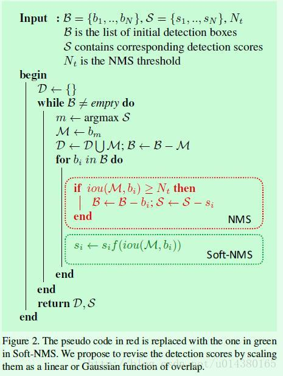

# Soft-NMS的原理

## 原理步骤：
1. 首先得出所有的预测框集合`B`、 对应框的得分`Scores`， NMS(IoU)阈值`T`;
2.  定义存放侯选框的集合`H`（初始为`Null`），对`Scores`排序选出得分最大的框为`maxBox`， 将`maxBox`从集合`B`中移到集合H中，集合`B`中没有`maxBox`框了;
3. 计算`maxBox`和`B`中剩余的所有框的IoU, 将IoU大于`T`的框的得分  **按某种方式** 降低（不删除了），
4. 重复2～3步骤，直到集合`B`为`Null`， 集合H中存放的框就是Soft-NMS处理的结果；
     重复步骤是：  
    （1）对集合B中剩余框对应的得分进行排序(`因为分数变化，必须排序`)， 选出最大得分的框maxBox，并从集合B中移到集合H中。
    
    （2） 计算这个得分最大的框maxBox和集合B中框的IoU阈值，将大于IoU阈值的框对应的得分降低。
5.  Soft-NMS返回的结果是 框以及框对应的得分（得分是Soft-NMS抑制后的），说白了，就是抑制了框对应的得分， 使用时需要一个得分阈值。



## Soft-NMS权重函数的形式
$M$表示得分最大框， $b_i$是除去得分最大框后剩余的每个框。
原来的NMS可以描述如下：将IoU大于阈值的窗口的得分全部置为0。
$$
s_i = \left\{
    \begin{array}{lr}s_i, iou(M,b_i) < T \\ 0,  iou(M,b_i) >= T
    \end{array}
    \right.
$$

(1) 线性加权抑制得分
$$
s_i = \left\{
    \begin{array}{lr}s_i,   iou(M,b_i) < T \\ s_i(1 - iou(M, b_i)),  iou(M,b_i) > =T
    \end{array}
    \right.
$$
(2) 高斯加权抑制得分
$$
s_i = s_ie^{-\frac{iou(M, b_i)^2}{\sigma}},  \forall b_i \notin D
$$

## NMS-Soft 实现代码
### Pytorch 代码  未验证 没有合适比较代码【欢迎指正错误】
```python
from torch import Tensor
import torch


def box_area(boxes: Tensor) -> Tensor:
    return (boxes[:, 2] - boxes[:, 0]) * (boxes[:, 3] - boxes[:, 1])


def box_iou(boxes1: Tensor, boxes2: Tensor) -> Tensor:
    area1 = box_area(boxes1)  # 每个框的面积 (N,)
    area2 = box_area(boxes2)  # (M,)

    lt = torch.max(boxes1[:, None, :2], boxes2[:, :2])  # [N,M,2] # N中一个和M个比较； 所以由N，M 个
    rb = torch.min(boxes1[:, None, 2:], boxes2[:, 2:])  # [N,M,2]

    wh = (rb - lt).clamp(min=0)  # [N,M,2]  # 删除面积小于0 不相交的  clamp 钳；夹钳；
    inter = wh[:, :, 0] * wh[:, :, 1]  # [N,M]  # 切片的用法 相乘维度减1
    iou = inter / (area1[:, None] + area2 - inter)
    return iou  # NxM， boxes1中每个框和boxes2中每个框的IoU值；


def soft_nms(boxes: Tensor, scores: Tensor, soft_threshold=0.01,  iou_threshold=0.7, weight_method=2, sigma=0.5):
    """
    :param boxes: [N, 4]， 此处传进来的框，是经过筛选（选取的得分TopK）之后的
    :param scores: [N]
    :param iou_threshold: 0.7
    :param soft_threshold soft nms 过滤掉得分太低的框 （手动设置）
    :param weight_method 权重方法 1. 线性 2. 高斯
    :return:
    """
    keep = []
    idxs = scores.argsort()
    while idxs.numel() > 0:  # 循环直到null； numel()： 数组元素个数
        # 由于scores得分会改变，所以每次都要重新排序，获取得分最大值
        idxs = scores.argsort()  # 评分排序
        if idxs.size(0) == 1:  # 就剩余一个框了；
            keep.append(idxs[-1])  
            break
        keep_len = len(keep)
        max_score_index = idxs[-(keep_len + 1)]
        max_score_box = boxes[max_score_index][None, :]  # [1, 4]
        idxs = idxs[:-(keep_len + 1)]
        other_boxes = boxes[idxs]  # [?, 4]
        keep.append(max_score_index)  # 位置不能边
        ious = box_iou(max_score_box, other_boxes)  # 一个框和其余框比较 1XM
        # Soft NMS 处理， 和 得分最大框 IOU大于阈值的框， 进行得分抑制
        if weight_method == 1:   # 线性抑制  # 整个过程 只修改分数
            ge_threshod_bool = ious[0] >= iou_threshold
            ge_threshod_idxs = idxs[ge_threshod_bool]
            scores[ge_threshod_idxs] *= (1. - ious[0][ge_threshod_bool])  # 小于IoU阈值的不变
            # idxs = idxs[scores[idxs] >= soft_threshold]  # 小于soft_threshold删除， 经过抑制后 阈值会越来越小；
        elif weight_method == 2:  # 高斯抑制， 不管大不大于阈值，都计算权重
            scores[idxs] *= torch.exp(-(ious[0] * ious[0]) / sigma) # 权重(0, 1]
            # idxs = idxs[scores[idxs] >= soft_threshold]
        # else:  # NMS
        #     idxs = idxs[ious[0] <= iou_threshold]

    # keep = scores[scores > soft_threshold].int()
    keep = idxs.new(keep)  # Tensor
    keep = keep[scores[keep] > soft_threshold]  # 最后处理阈值
    boxes = boxes[keep]  # 保留下来的框
    scores = scores[keep]  # soft nms抑制后得分
    return boxes, scores
```


